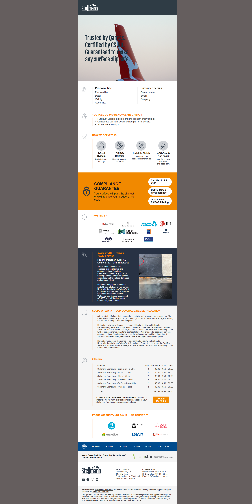

# Stellmann HTML Proposal Template

Responsive, email-like HTML template for Stellmann commercial proposals. Built with inline CSS for compatibility with CRM systems and email clients.

## Features
- Table-based layout for maximum compatibility
- Responsive images with fallback alt text
- Fully self-contained: all assets included in `/images`
- Uses semantic HTML where possible
- Optimized for use as proposal documents (screen viewing)

## Usage
Open `index.html` in any browser or embed the template into your CRM/email system. Update text and images as needed.

## Preview

## Author
Developed by Oleg D.

